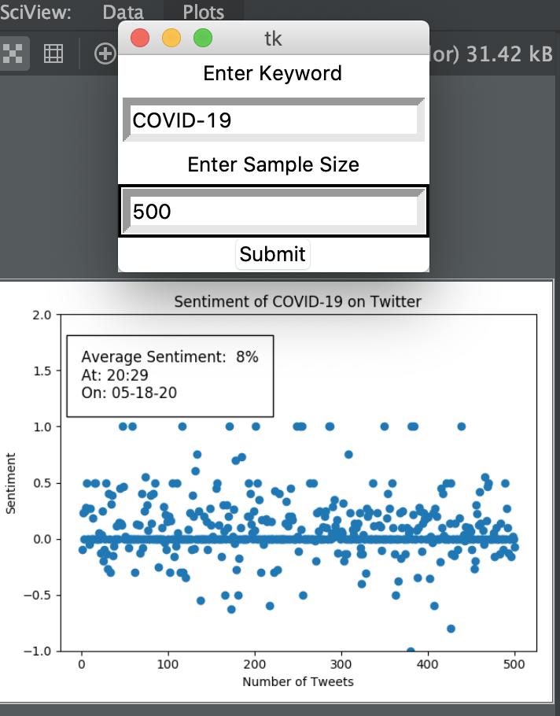

# Author: Kazi Amit Hasan

Department of Computer Science & Engineering,  
Rajshahi University of Engineering & Technology (RUET)  
Website: https://amithasanshuvo.github.io/  
Linkedin: https://www.linkedin.com/in/kazi-amit-hasan-514443140/  
Email: kaziamithasan89@gmail.com
# TwitterMining
This is a data mining project which I took as my sixth semester project. A project which fetches real-time data from Twitter using credentials and analyzes the sentiments and generates a visual that represents the sentiments of a specific word/tweets. Users can submit a word and sample numbers, the UI will show the sentiment visuals

# Tools used:
Language used: Python  
Development Tools: PyCharm
# Requirements
Create a twitter developers account and generate all four secret keys and paste them in twitter credentials file. Then you are good to go.

# Demo UI

## Future Works:
Make a simple and interactive GUI for this,Update the code.
